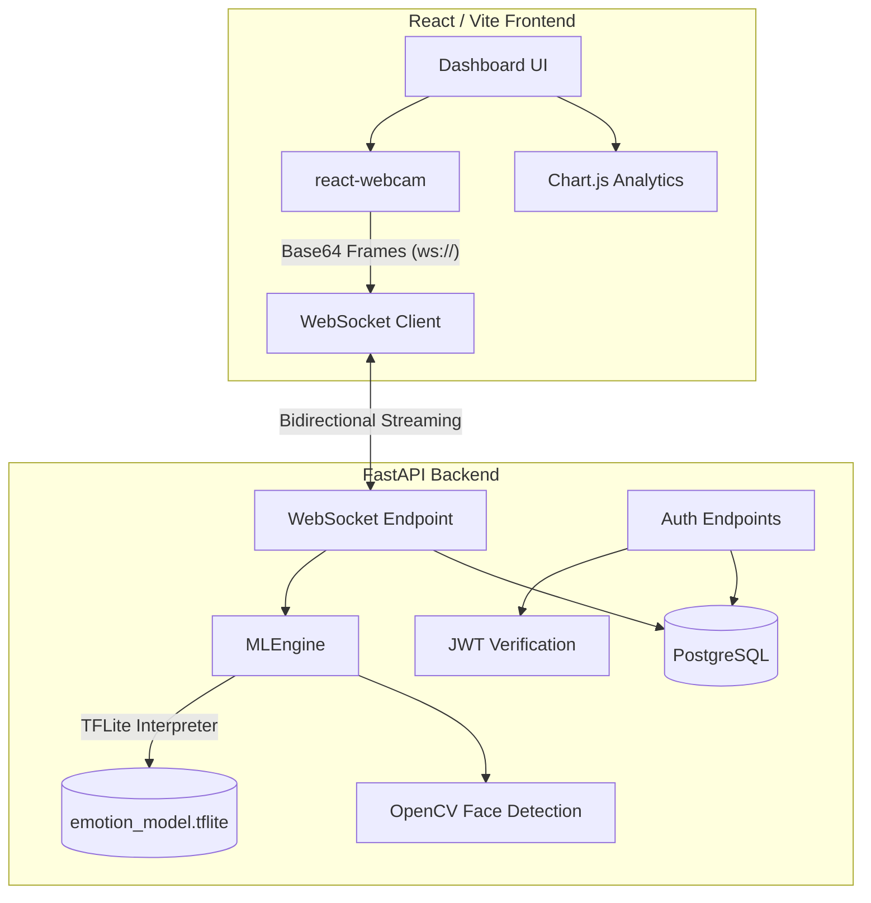

# Emotion Sense AI


Emotion Sense AI is a production-ready, full-stack application that performs real-time facial expression recognition. Leveraging a custom-trained Convolutional Neural Network (CNN) optimized with TensorFlow Lite, the application captures webcam feeds, infers emotional states (Happy, Sad, Angry, Surprise, Neutral, etc.) with sub-100ms latency via WebSockets, and visualizes the analytics dynamically on a sleek React dashboard.

## 🌟 Key Features
- **Real-Time Inference**: Sub-second latency utilizing WebSockets and TensorFlow Lite.
- **Modern Dashboard**: Premium dark-mode UI built with React, Tailwind CSS, and Framer Motion.
- **Analytics & Reporting**: Interactive Chart.js visualizations, CSV exports, and PDF report generation.
- **Secure Architecture**: FastAPI backend fortified with JWT-based authentication and role-based access control.
- **Cloud-Ready Deployment**: Fully Dockerized with Vercel and Render configurations built-in.

---

## 🏛️ Architecture Diagram



---

## 📸 Screenshots

| Dashboard View | Analytics View |
|:---:|:---:|
|  |  |
| *Live Webcam tracking with dynamic confidence scoring.* | *Detailed breakdown of session statistics and historical trends.* |

---

## 🚀 Installation Guide

### Prerequisites
- Python 3.9+
- Node.js 18+
- PostgreSQL (or Docker)

### 1. Clone the Repository
```bash
git clone https://github.com/yourusername/emotion-sense-ai.git
cd emotion-sense-ai
```

### 2. Backend Setup
```bash
cd backend
python -m venv venv
source venv/bin/activate  # On Windows: venv\Scripts\activate
pip install -r requirements.txt
```
*Make sure to configure your `.env` file with `DATABASE_URL` and `SECRET_KEY`.*

```bash
# Start the FastAPI server
uvicorn app.main:app --reload
```

### 3. Frontend Setup
```bash
cd ../frontend
npm install
npm run dev
```

### 4. Docker (Optional / Production)
To spin up the entire stack seamlessly:
```bash
docker-compose up -d --build
```

---

## 📖 API Documentation

Once the backend is running, the interactive Swagger documentation is available automatically at `http://localhost:8000/docs` (powered by FastAPI).

### Core Endpoints:
- **`POST /api/v1/auth/login`**: Authenticate and retrieve JWT access token.
- **`POST /api/v1/emotions/predict`**: Upload a static image file for expression analysis.
- **`WS /api/v1/emotions/ws/predict`**: WebSocket endpoint for streaming real-time base64 frame inference.
- **`GET /api/v1/emotions/history`**: Retrieve the authenticated user's historical predictions.

---

## 🔮 Future Improvements

- **WebRTC Upgrade**: Transition from Base64 WebSocket streaming to native WebRTC video tracks to further reduce bandwidth and structural latency.
- **Multi-Face Tracking**: Enhance the OpenCV cascade logic to detect, identify, and track multiple faces simultaneously in a crowd.
- **Edge Deployment**: Port the TFLite model to TensorFlow.js to allow inference to run entirely on the client's browser, eliminating server compute costs.
- **Temporal Analysis**: Implement an LSTM or Transformer network to analyze emotion *changes* over sequential timeframes rather than classifying isolated, independent frames.